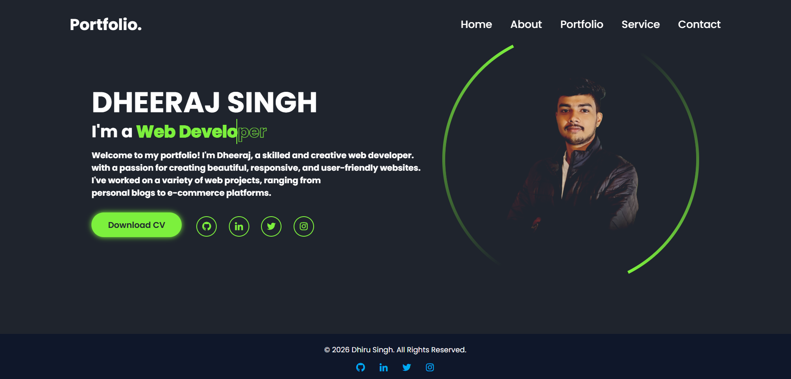

## Personal Portfolio Website

**HTML | CSS | Responsive | Animated UI**

A modern, responsive, and visually appealing Personal Portfolio Website built using HTML & CSS.
This project showcases my skills, projects, and social presence with smooth animations and a clean UI design.

# ✨ Features

🎨 Modern UI with smooth animations

📱 Fully Responsive (Mobile + Desktop)

💼 Professional Portfolio Layout

🔁 Text Animation for Roles

🖼️ Circular Animated Profile Image

📎 Downloadable Resume Button

🌍 Social Media Integration

⚡ Fast & Lightweight

# 🛠️ Technologies Used

```bash
HTML5 – Structure

CSS3 – Styling & Animations

Boxicons – Icons

Google Fonts (Poppins) – Typography
```


# 📸 Screenshots

**Home Page**  



